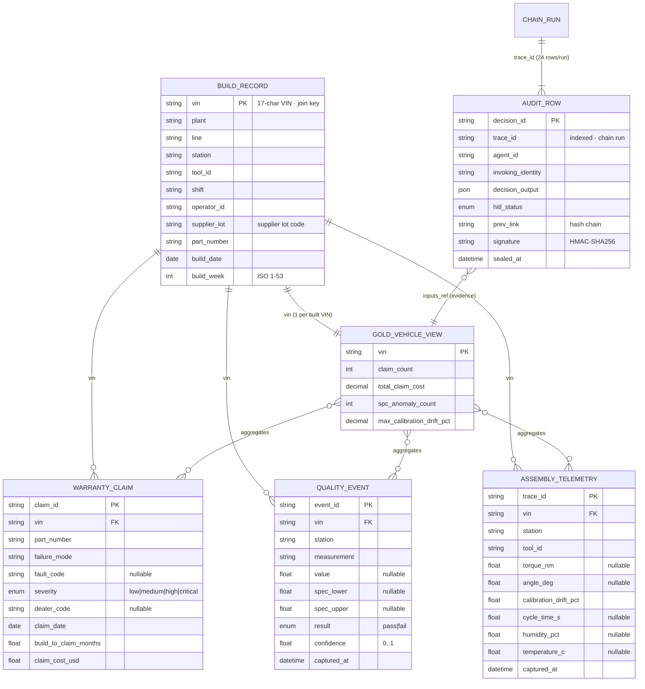

# Zero Day Warranty — Data Model (ERD & data dictionary)

The full entity / data / relationship model behind the solution: the four
source domains, the per-VIN Gold view, and the audit ledger — with attributes,
types, keys, relationships, the medallion layer mapping, and sensitivity
classification. This is the text-native data design; it is derived from, and
must stay in sync with, the code:

- Silver/source entities → [`src/zero_day_warranty/domains.py`](../../src/zero_day_warranty/domains.py)
- Gold view → [`src/zero_day_warranty/medallion.py`](../../src/zero_day_warranty/medallion.py)
- Audit ledger → [`src/zero_day_warranty/audit.py`](../../src/zero_day_warranty/audit.py)
- Physical DDL (Postgres) → [`infra/scripts/postgres-schemas.sql`](../../infra/scripts/postgres-schemas.sql)

**VIN is the single conformed join key** across all four source domains.

## 1. Entity-relationship diagram

> If Mermaid isn't rendered in your viewer: BUILD_RECORD is the parent; one VIN
> has many warranty claims, quality events, and telemetry traces. The Gold view
> is one row per built VIN that aggregates the three child sets. Each chain run
> (one `trace_id`) emits 24 hash-chained AUDIT_ROWs.

## 2. Source entities (Silver · canonical)

### 2.1 BuildRecord — `zdw_silver.build_records`
Every VIN's complete factory build history, per installed part.

| Column | Type | Key | Null | Description |
|---|---|---|---|---|
| vin | string(≥11) | **PK** | no | Vehicle Identification Number — the conformed join key |
| plant | string | | no | Assembly plant code |
| line | string | | no | Assembly line |
| station | string | | no | Build station |
| tool_id | string | | no | Tool used at the station |
| shift | string | | no | Build shift (A/B/C) |
| operator_id | string | | no | Operator |
| supplier_lot | string | | no | Supplier lot code for the installed part |
| part_number | string | | no | Part number |
| build_date | date | | no | Date the vehicle was built |
| build_week | int (1–53) | | no | ISO build week |

### 2.2 WarrantyClaim — `zdw_silver.warranty_claims`
A field warranty claim / failure mode tied back to a VIN.

| Column | Type | Key | Null | Description |
|---|---|---|---|---|
| claim_id | string | **PK** | no | Claim identifier |
| vin | string | **FK → build_records.vin** | no | Vehicle |
| part_number | string | | no | Failed part |
| failure_mode | string | | no | Failure mode |
| fault_code | string | | yes | Diagnostic / fault code |
| severity | enum `Severity` | | no | low \| medium \| high \| critical (default medium) |
| dealer_code | string | | yes | Reporting dealer |
| claim_date | date | | no | Date of claim |
| build_to_claim_months | float (≥0) | | no | Months from build to claim |
| claim_cost_usd | float (≥0) | | no | Cost of the claim (USD) |

### 2.3 QualityEvent — `zdw_silver.quality_events`
An inspection / measurement / defect captured during the build (also the record
emitted by the Day-0 NVIDIA Metropolis layer).

| Column | Type | Key | Null | Description |
|---|---|---|---|---|
| event_id | string | **PK** | no | Event identifier |
| vin | string | **FK → build_records.vin** | no | Vehicle |
| station | string | | no | Station where measured |
| measurement | string | | no | What was measured / inspected |
| value | float | | yes | Measured value |
| spec_lower | float | | yes | Lower spec limit |
| spec_upper | float | | yes | Upper spec limit |
| result | enum `InspectionResult` | | no | pass \| fail (default pass) |
| confidence | float (0–1) | | no | Inspection confidence (default 1.0) |
| captured_at | datetime | | no | Capture timestamp |

*Derived:* `is_spc_anomaly()` — true when `value` falls outside `[spec_lower,
spec_upper]`, or `result = fail` when no value.

### 2.4 AssemblyTelemetry — `zdw_silver.assembly_telemetry`
Equipment state, throughput, and asset events from the production floor.

| Column | Type | Key | Null | Description |
|---|---|---|---|---|
| trace_id | string | **PK** | no | Telemetry trace identifier |
| vin | string | **FK → build_records.vin** | no | Vehicle |
| station | string | | no | Station |
| tool_id | string | | no | Tool |
| torque_nm | float | | yes | Fastening torque (N·m) |
| angle_deg | float | | yes | Fastening angle (deg) |
| calibration_drift_pct | float | | no | Tool drift vs. calibrated baseline (default 0) |
| cycle_time_s | float | | yes | Cycle time (s) |
| humidity_pct | float | | yes | Ambient humidity |
| temperature_c | float | | yes | Ambient temperature |
| captured_at | datetime | | no | Capture timestamp |

## 3. Gold view — `zdw_gold.g_vehicle_root_cause`
One row per built VIN, joining the four domains for the agent to read.
Classification: **supplier-confidential** · identity-scoped.

| Column | Type | Source / derivation |
|---|---|---|
| vin | string (PK, grain) | build_records |
| plant, line, station, tool_id, shift, supplier_lot, build_week | — | build_records |
| claim_count | int | count(warranty_claims by vin) |
| total_claim_cost | decimal | sum(warranty_claims.claim_cost_usd) |
| spc_anomaly_count | int | count(quality_events where out-of-spec or fail) |
| max_calibration_drift_pct | decimal | max(assembly_telemetry.calibration_drift_pct) |

In code the Gold row also carries the full child collections
(`GoldVehicleView.claims / quality_events / telemetry`) plus `has_claim` and
`total_claim_cost` helpers.

## 4. Audit ledger — `zdw_gold.audit_ledger`
Append-only, hash-chained decision record. **One row per chain step** (24 per
run); keyed by `decision_id`, indexed by `trace_id`. WORM-style: `UPDATE` /
`DELETE` blocked by trigger.

**14 required fields:** `trace_id`, `decision_id` (PK), `agent_id`,
`invoking_identity`, `manifest_version`, `policy_version`, `model_version`,
`prompt_version`, `inputs_ref`, `tools_called` (json[]), `reasoning_trace_ref`,
`decision_output` (json), `hitl_status` (enum), `downstream_effect_ref` (nullable
= advisory).

**Carried optionals:** `cost_attribution` (json), `sensitivity_label_propagation`
(json[]), `confidence_score` (float).

**Seal metadata:** `sealed_at` (timestamptz), `prev_link` (prior row's
signature; genesis = 64 zeros), `signature` (HMAC-SHA256 over the canonical row).
Integrity is `verify_chain()`: every signature valid **and** each `prev_link`
matches the previous row's signature.

## 5. Enumerations

| Enum | Values |
|---|---|
| `Severity` | low · medium · high · critical |
| `InspectionResult` | pass · fail |
| `HitlStatus` | none · pending · approved · modified · rejected · overridden |

## 6. Medallion layer mapping

| Layer | Objects | Notes |
|---|---|---|
| **Bronze** `zdw_bronze.*` | raw landing of the four domains | source-native, append-only, schema-on-read; PII tokenized at the Bronze→Silver boundary |
| **Silver** `zdw_silver.*` | `build_records`, `warranty_claims`, `quality_events`, `assembly_telemetry` | canonical, VIN-conformed, typed, deduplicated |
| **Gold** `zdw_gold.g_vehicle_root_cause` | per-VIN joinable view | agent-safe, classification-aware, identity-scoped |
| **Gold (audit)** `zdw_gold.audit_ledger` | hash-chained decision rows | append-only / WORM |

Indexes (Postgres): `vin` on each child table; `supplier_lot` and `build_week`
on `build_records`; `trace_id` on `audit_ledger`. Production target is Microsoft
Fabric OneLake; the schema names and the per-VIN Gold contract carry over.

## 7. Classification & lineage

- **Sensitivity:** build/quality/telemetry → `internal`; warranty + supplier-lot
  attribution and the chargeback artifacts → `supplier-confidential`. The agent
  propagates `("internal", "supplier-confidential")` on every audit row.
- **PII:** dealer/operator identifiers are tokenized at Bronze→Silver; raw PII
  never lands in Silver (hardening item — see the Experts Panel gap log).
- **Lineage:** source → Bronze → Silver → Gold → agent decision → audit row, with
  Microsoft Purview lineage + DLP across the path; each decision's `inputs_ref`
  points back at the Gold view it read.

---

> **Note on "EDR".** This document is the **entity-data-relationship** model. If
> you instead meant the in-vehicle **Event Data Recorder (EDR)** as an additional
> source, it slots in as a fifth domain (VIN-keyed crash/telematics frames)
> feeding the warranty/telemetry join — say the word and I'll add it as a
> first-class entity here and in `domains.py`.
